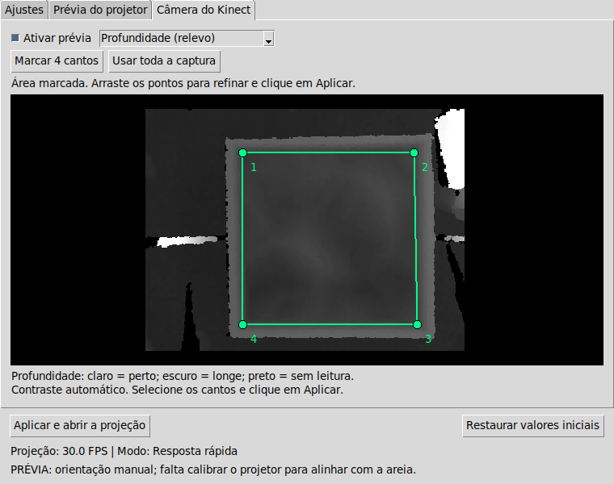

<p align="center">
  
</p>

# Kinect Livre — Caixa de Areia com Realidade Aumentada

Projeto do **Colmeia — grupo de extensão em software e hardware livre da UDESC**. Utiliza o Kinect para medir a superfície da areia e o SARndbox para projetar cores, curvas de nível e água simulada sobre o relevo.

Esta versão reúne o código do **Kinect 3.10**, adaptações do **SARndbox 2.8** e um **painel de configuração em Python/Tkinter**. O painel permite ajustar a caixa pela interface, sem digitar argumentos do SARndbox a cada utilização.

[Manual ilustrado do painel](Kinect-3.10/Manual%20Caixa%20de%20Areia%20-%20Painel%20Python.pdf) · [Código do painel](Kinect-3.10/regular_altura.py) · [Código nativo adaptado](Kinect-3.10/ajuste_altura/native)

## O que o painel permite fazer

- Ajustar fundo, nível azul/verde e topo da areia, em centímetros relativos ao plano de referência.
- Ver a **profundidade do Kinect**, marcar os quatro cantos internos da caixa e arrastar os pontos para limitar a área utilizada no relevo.
- Alternar para a câmera colorida para conferir a montagem.
- Ver uma prévia da imagem enviada ao projetor, com o contador de FPS apenas no painel.
- Girar a imagem e ajustar seu tamanho na visão manual, além de recortar bordas da projeção.
- Ativar sombreamento e curvas de nível e escolher perfis de desempenho.
- Abrir a projeção em tela cheia na única tela externa ativa, quando identificada.
- Salvar os ajustes aplicados para a próxima utilização.



*A seleção verde é feita no painel. A imagem de profundidade continua mostrando o sensor inteiro para permitir corrigir os cantos.*

## Requisitos e dependências

A montagem usa Kinect para Xbox 360 com alimentação e adaptador USB, projetor, caixa com areia e suporte fixo para os equipamentos.

A versão local foi utilizada em **Ubuntu 22.04.5 LTS**, com:

| Componente | Versão ou requisito |
| --- | --- |
| Vrui | 8.0, com sistema de compilação em `/usr/local/share/Vrui-8.0/make` |
| Biblioteca Kinect | 3.10, instalada no ambiente Vrui |
| SARndbox | 2.8, com arquivos de configuração e shaders |
| Painel | Python 3 e Tkinter (`python3-tk`) |
| Vídeo | Aceleração OpenGL e `xrandr` (`x11-xserver-utils`) |
| Compilação | Compilador C++, GNU Make e dependências dos projetos acima |

**Clonar o repositório não instala essas dependências.** A pasta `Kinect-3.10/SARndbox-2.8` versionada é um link simbólico para a instalação original em `/home/colmeia/src/SARndbox-2.8`; ela não contém uma distribuição independente do SARndbox. Os binários, objetos de compilação e atalhos copiados da montagem original também podem conter caminhos locais.

## Preparação e compilação

### 1. Instale a base do projeto

Instale **Vrui → Kinect → SARndbox**, nessa ordem, seguindo os README das versões utilizadas. O [README do Kinect 3.10](Kinect-3.10/Kinect-3.10/README) contém os requisitos e as instruções de instalação da biblioteca. Para Vrui e SARndbox, consulte o README fornecido no respectivo pacote de fontes.

Com Vrui instalado, os comandos básicos para compilar e instalar a biblioteca Kinect, executados a partir da raiz deste repositório, são:

```bash
cd Kinect-3.10
env -u DEBUG make clean
env -u DEBUG make -j2
sudo env -u DEBUG make install
sudo env -u DEBUG make installudevrules
sudo udevadm control --reload-rules
```

Execute um comando por vez e prossiga somente se ele terminar sem erro. Reconecte o Kinect após instalar as regras de acesso. `env -u DEBUG` evita herdar da IDE uma configuração que faça o make procurar uma instalação de depuração inexistente.

### 2. Disponibilize os recursos do SARndbox no caminho esperado

O painel define `SANDBOX = ROOT.parent / "SARndbox-2.8"`. Como `ROOT` é a pasta que contém `regular_altura.py`, ao executar a partir do clone ele espera esta estrutura:

```text
Kinect-Livre/
├── README.md
├── Kinect-3.10/
│   ├── regular_altura.py
│   ├── projecao_visual.py
│   ├── area_scan.py
│   └── ajuste_altura/native/
└── SARndbox-2.8/                  # instalação local, não fornecida pelo clone
    ├── etc/SARndbox-2.8/
    └── share/SARndbox-2.8/Shaders/
```

Coloque a instalação completa do SARndbox nessa posição ou crie um link para uma instalação existente. Por exemplo, **na raiz do clone**, se o SARndbox já estiver em `~/src/SARndbox-2.8` e ainda não existir uma entrada `SARndbox-2.8` na raiz:

```bash
ln -s "$HOME/src/SARndbox-2.8" SARndbox-2.8
```

Esse link na **raiz do clone** atende ao caminho usado pelo painel. O link que já existe **dentro de `Kinect-3.10`** não substitui essa configuração.

A pasta de configuração precisa conter os recursos do SARndbox, incluindo `HeightColorMap.cpt` e `BoxLayout.txt`. O plano de referência e a calibração devem corresponder à montagem física utilizada; arquivos de exemplo não são uma calibração da sua caixa.

### 3. Recompile a versão adaptada

A partir da raiz do repositório, com as dependências instaladas e o caminho acima preparado:

```bash
cd Kinect-3.10
SAR_DIR="$(cd ../SARndbox-2.8 && pwd -P)"
env -u DEBUG make -C ajuste_altura/native clean
env -u DEBUG make -C ajuste_altura/native -j2 \
  INSTALLDIR="$SAR_DIR" bin/SARndbox
```

O painel utiliza **`ajuste_altura/native/bin/SARndbox`**, que inclui as prévias e a seleção de área. Recompilar adapta o executável aos caminhos e às bibliotecas da máquina. Mantenha os shaders e as configurações da instalação indicada por `INSTALLDIR`.

### 4. Abra o painel

Na raiz do repositório:

```bash
python3 Kinect-3.10/regular_altura.py
```

Para iniciar a projeção ao abrir e selecionar uma das prévias:

```bash
python3 Kinect-3.10/regular_altura.py --abrir
python3 Kinect-3.10/regular_altura.py --camera
```

Use apenas um desses comandos por vez. `--abrir` seleciona a prévia do projetor; `--camera` seleciona a aba do Kinect e utiliza o modo de câmera salvo.

O arquivo `Painel da Caixa de Areia.desktop` contém caminhos da máquina original. Antes de usá-lo em outra instalação, ajuste os campos `Exec`, `Path` e `Icon` para os caminhos locais.

## Uso pela interface

1. Conecte Kinect e projetor. Configure o sistema para **estender as telas**, mantendo o computador como tela principal.
2. Feche outros programas que estejam usando o Kinect e clique em **Aplicar e abrir a projeção**.
3. Na aba **Câmera do Kinect**, ative a prévia, escolha **Profundidade (relevo)** e aplique.
4. Clique em **Marcar 4 cantos**. Selecione as bordas internas na ordem: superior esquerdo, superior direito, inferior direito e inferior esquerdo. Arraste os pontos para refinar e clique em **Aplicar**.
5. Na aba **Ajustes**, regule as alturas mantendo **Fundo < Nível azul/verde < Topo**. Mude um valor de cada vez e confira o resultado.
6. Use **Prévia do projetor** para acompanhar cores, relevo e enquadramento. Os controles e o contador de FPS ficam somente no painel.

**Aplicar reinicia a projeção e zera a água simulada.** Os valores aplicados ficam salvos em `ajuste_altura/valores.json`; a área selecionada fica em `ajuste_altura/area_scan.txt`.

Para retirar a seleção, use **Usar toda a captura** e aplique. Ao aplicar uma área selecionada, os recortes antigos de borda são zerados para não esconder partes dela.

### Desempenho e calibração

- **Resposta rápida:** filtro mais curto, mantendo a grade de água do perfil habitual.
- **Mais leve:** reduz o trabalho da simulação de água.
- **Mais suave:** aumenta a suavização quando a superfície fica tremendo.
- **Perfil do manual:** mantém o filtro mais longo do comportamento anterior.

As prévias atualizam até 5 imagens/s; o FPS da projeção é medido separadamente. A prévia pode parecer menos fluida mesmo quando a projeção está funcionando normalmente.

**Selecionar a área não substitui a calibração.** A marcação limita a leitura e utiliza o plano de referência existente. A matriz `ProjectorMatrix.dat` é necessária para alinhar fisicamente a imagem do projetor com a areia. Sem ela, o painel trabalha em visão manual e informa que falta calibrar. Se mover a caixa, o Kinect ou o projetor, revise a calibração e a seleção.

## Organização do código

| Caminho | Conteúdo |
| --- | --- |
| [`Kinect-3.10/`](Kinect-3.10/) | Código e ferramentas do Kinect, painel e arquivos da montagem |
| [`regular_altura.py`](Kinect-3.10/regular_altura.py) | Interface Tkinter e controle da execução da projeção |
| [`projecao_visual.py`](Kinect-3.10/projecao_visual.py) | Aparência, orientação, enquadramento e perfis de desempenho |
| [`area_scan.py`](Kinect-3.10/area_scan.py) | Desenho, arraste e validação dos quatro cantos |
| [`ajuste_altura/native/`](Kinect-3.10/ajuste_altura/native/) | Fontes do SARndbox adaptados para o painel |
| [`manual_painel/`](Kinect-3.10/manual_painel/) | Geração do manual, capturas da interface e arquivos de revisão |

## Testes

Com a instalação externa do SARndbox preparada, o executável adaptado compilado e uma sessão gráfica disponível:

```bash
cd Kinect-3.10
python3 -m unittest test_area_scan test_preview_painel test_projecao_visual -v
```

Os testes verificam seleção de área, transformações e comportamento da interface. Os testes Tkinter precisam de uma tela disponível; os testes que montam o comando de projeção também consultam recursos locais do SARndbox. Um clone sem essas dependências não é suficiente para executar toda a suíte. Esses testes não comprovam o alinhamento físico do projetor nem substituem a conferência com a caixa real.

## Autoria e licenças

**Gustavo Lass — bolsista do Colmeia:** desenvolvimento do painel Python, adaptações locais de integração e atualização do manual de uso.

A base tecnológica utiliza Kinect, Vrui e SARndbox, de **Oliver Kreylos / KeckCAVES, UC Davis**, preservando os créditos dos projetos originais. Consulte os arquivos [COPYING do Kinect](Kinect-3.10/Kinect-3.10/COPYING) e [COPYING do SARndbox adaptado](Kinect-3.10/ajuste_altura/native/COPYING), além dos avisos nos fontes, para as condições de licença aplicáveis.

## Colmeia e contribuições

O Colmeia promove conhecimento em software e hardware livres por meio de projetos, aulas, minicursos e atividades de extensão. O Kinect Livre explora como ferramentas abertas permitem continuar utilizando o sensor em projetos educativos e exposições.

Para contribuir, abra uma issue ou envie um pull request descrevendo a mudança, o ambiente utilizado e as verificações realizadas. Para problemas de execução, informe as versões instaladas e o erro relevante do arquivo `Kinect-3.10/ajuste_altura/sarndbox.log`.

[GitHub do Colmeia](https://github.com/ColmeiaUDESC) · [Instagram](https://www.instagram.com/colmeiaudesc/) · [YouTube](https://www.youtube.com/channel/UC51KrWL94AfGxI_4l_E7uzA) · [Discord](https://discord.gg/yZZsV4xABZ)
